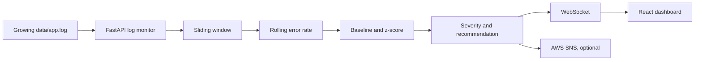

# SentinelPulse

**Real-Time Log Anomaly Detector with Alert Feed**

SentinelPulse watches a growing application log, calculates a rolling error rate, compares it with a baseline, and sends anomaly alerts to a live React dashboard. It can also publish HIGH and CRITICAL alerts to AWS SNS.

## Features

- Tails `data/app.log` as new lines are appended.
- Uses a sliding window to calculate the current error rate.
- Learns a baseline from the first completed normal windows and avoids adding anomalous windows to it.
- Scores deviations with a z-score and assigns MEDIUM, HIGH, or CRITICAL severity.
- Sends metrics and alerts to the dashboard over WebSocket.
- Gives deterministic, message-based investigation recommendations.
- Optionally publishes HIGH and CRITICAL alerts to AWS SNS.

## Architecture



## Requirements

- Windows, macOS, or Linux
- Python 3.11 or newer (regular CPython; do not use the experimental free-threaded `3.13t` interpreter with these pinned dependencies)
- Node.js LTS and npm
- VS Code is recommended for the three-terminal demo workflow

## Run in VS Code on Windows

Open the project root—the folder containing `backend`, `frontend`, and `scripts`—in VS Code. Open three terminals using **Terminal → New Terminal**. Keep each process running in its own terminal.

### Terminal 1: backend

```powershell
cd backend
py -3.13 -m venv .venv
.\.venv\Scripts\Activate.ps1
python -m pip install -r requirements.txt
Copy-Item .env.example .env
uvicorn main:app --reload --port 8000
```

If your installed regular Python version is 3.12 or 3.11, replace `py -3.13` with `py -3.12` or `py -3.11`.

If PowerShell blocks activation, allow scripts only for that terminal session, then activate again:

```powershell
Set-ExecutionPolicy -Scope Process -ExecutionPolicy Bypass
.\.venv\Scripts\Activate.ps1
```

The health endpoint is http://127.0.0.1:8000/health.

### Terminal 2: frontend

Open a new terminal at the project root:

```powershell
cd frontend
npm install
npm run dev
```

Open the local URL Vite prints, normally http://localhost:5173.

### Terminal 3: demo logs

Open a new terminal at the project root:

```powershell
python scripts/generate_logs.py
```

The generator appends mostly normal events and periodically injects an error burst. Wait for baseline learning and then for the burst to trigger an alert. Press **Ctrl+C** in this terminal to stop log generation.

To run a steady normal stream, use `python scripts/generate_logs.py --scenario normal`. For a predictable incident demo, stop the current generator and run `python scripts/generate_logs.py --scenario critical`; it writes 30 normal warm-up events, then switches to a 72% error rate. The default `cycle` scenario preserves the repeating burst behavior.

## Run the tests

From the project root, use the virtual environment created in `backend`:

```powershell
.\backend\.venv\Scripts\python.exe -m pip install -r backend\requirements-dev.txt
.\backend\.venv\Scripts\python.exe -m pytest
```

The tests cover log parsing, append-only monitoring, partial lines, truncation and rotation, sliding-window math, baseline protection, severity and zero-standard-deviation handling, alert de-duplication, SNS filtering and missing configuration, the health/status/metrics endpoints, and generator scenarios.

## API

| Method | Path | Purpose |
| --- | --- | --- |
| GET | `/health` | Basic health response: `{"status":"ok"}` |
| GET | `/api/health` | Health details, log path, and SNS configuration state |
| GET | `/api/status` | Current rate, baseline, monitor status, and active anomaly count |
| GET | `/api/metrics` | Recent timestamped error-rate observations |
| GET | `/api/alerts` | Recent alerts |
| WebSocket | `/ws` | Live metric and alert updates |

## Detection and alert behavior

The default sliding window contains 20 events. The baseline uses the first three complete rolling-window observations by default (`BASELINE_WINDOWS` in `backend/.env`). After baseline learning, the detector compares each error-rate observation with the baseline mean and standard deviation. Anomalous windows do not update the baseline.

Severity thresholds use z-score: MEDIUM at 2.5, HIGH at 3, and CRITICAL at 4. Absolute rate overrides also apply at 40%, 60%, and 80%, or at 20, 35, and 50 percentage points above baseline, respectively. A single alert is created when traffic enters an anomalous period; another can be created after the rate returns to normal and a new anomaly begins. Recommendations are selected by deterministic rules for database/connectivity/timeouts, authentication/token errors, and memory errors.

## AWS SNS (optional)

For local use, leave `AWS_SNS_TOPIC_ARN` empty in `backend/.env`. To enable notifications, set `AWS_REGION` and `AWS_SNS_TOPIC_ARN`, then configure credentials using your normal AWS credential provider or AWS CLI. SentinelPulse only sends HIGH and CRITICAL notifications. Never commit `.env` or AWS credentials.

## Project structure

```text
backend/       FastAPI monitor, detector, and AWS notifier
frontend/      React + Vite dashboard
scripts/       Continuous demo log generator
data/          Local app.log input
tests/         Pytest parser, detector, and API tests
```

## Git branch

Development is on `feature/sentinelpulse-mvp`. Push changes to that branch; merge into `main` only when you choose to.
